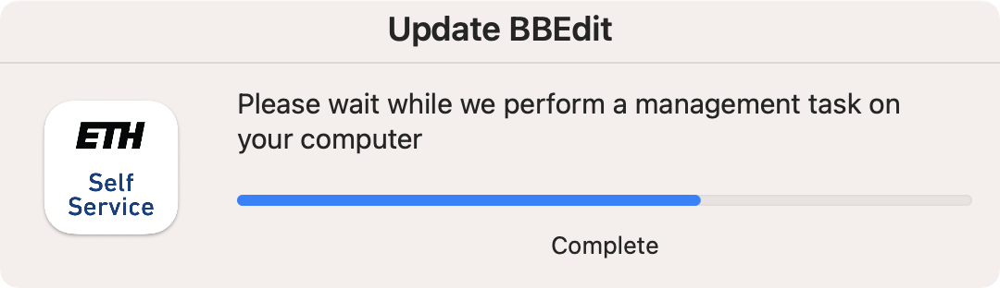

# jamf-scripts

A collection of scripts relevant for Jamf Pro admins.

Look in each folder for README files explaining the contents.

## PolicyProgressDialogs.zsh

Launches a swiftDialog mini message window in the bottom right corner whenever a policy runs. This is acheived using a LaunchDaemon that watches for changes to `jamf.log`.

Based on Bart Reardon's [jss-progress.sh](https://github.com/bartreardon/swiftDialog-scripts/blob/main/JamfSelfService/jss-progress.sh).

An icon can be specified using Parameter 4 in a Jamf Pro policy. This will be added to the LaunchDaemon as parameter 1 of the embedded script.

## PolicyProgressDialogs-template.zsh

This is the script that is embedded into `PolicyProgressDialogs.zsh` - not designed to be run alone, just here to make editing easier.
